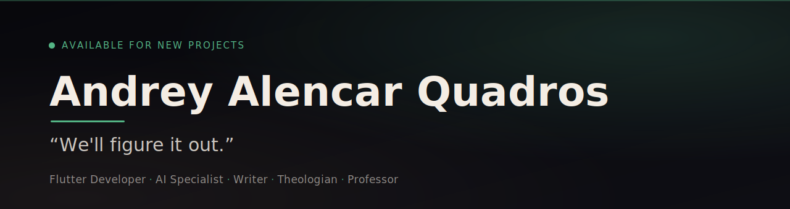

  

  
  
  

  <a href="#-português">🇧🇷 Português</a> &nbsp;·&nbsp; <a href="#-english">🇺🇸 English</a>

---

## 🇧🇷 Português

### 👋 Sou

Desenvolvedor **Flutter** e especialista em **IA** — também **escritor**, **teólogo** e **professor**. Cientista da Computação pela **Universidade Federal de Mato Grosso (UFMT)** e **Mestre em Propriedade Intelectual e Transferência de Tecnologia pelo PROFNIT/IFRO**. Filho de Deus, esposo da Julia, pai do Mathias.

📍 Ariquemes, RO — Brasil &nbsp;·&nbsp; 🌐 [andreyquadros.com.br](http://andreyquadros.com.br/)

### ⚡ Faço

- 📱 **Apps mobile** com Flutter & Dart
- 🤖 **IA aplicada** a produtos, automações e experiências
- ✍️ **Escrevo** — livros e conteúdo
- 🎓 **Ensino** como professor
- ⛓️ **Web3** — explorando Solana e certificados on-chain

---

## 🇺🇸 English

  

### 👋 About

**Flutter** developer and **AI** specialist — also a **writer**, **theologian** and **professor**. Computer Scientist (**UFMT**) with a **Master's in Intellectual Property &amp; Technology Transfer — PROFNIT/IFRO**. Child of God, husband to Julia, father to Mathias.

📍 Ariquemes, RO — Brazil &nbsp;·&nbsp; 🌐 [andreyquadros.com.br](http://andreyquadros.com.br/)

### ⚡ What I do

- 📱 **Mobile apps** with Flutter & Dart
- 🤖 **Applied AI** for products, automation and experiences
- ✍️ **Writing** — books and content
- 🎓 **Teaching** as a professor
- ⛓️ **Web3** — exploring Solana and on-chain certificates

---

### 🛠️ Tecnologias · Tech

  
  
  
  
  
  
  

Explorando · Exploring: Next.js · TypeScript · Solana / Web3

### 📊 GitHub

  
  

---

<em>“We'll figure it out.”</em>

